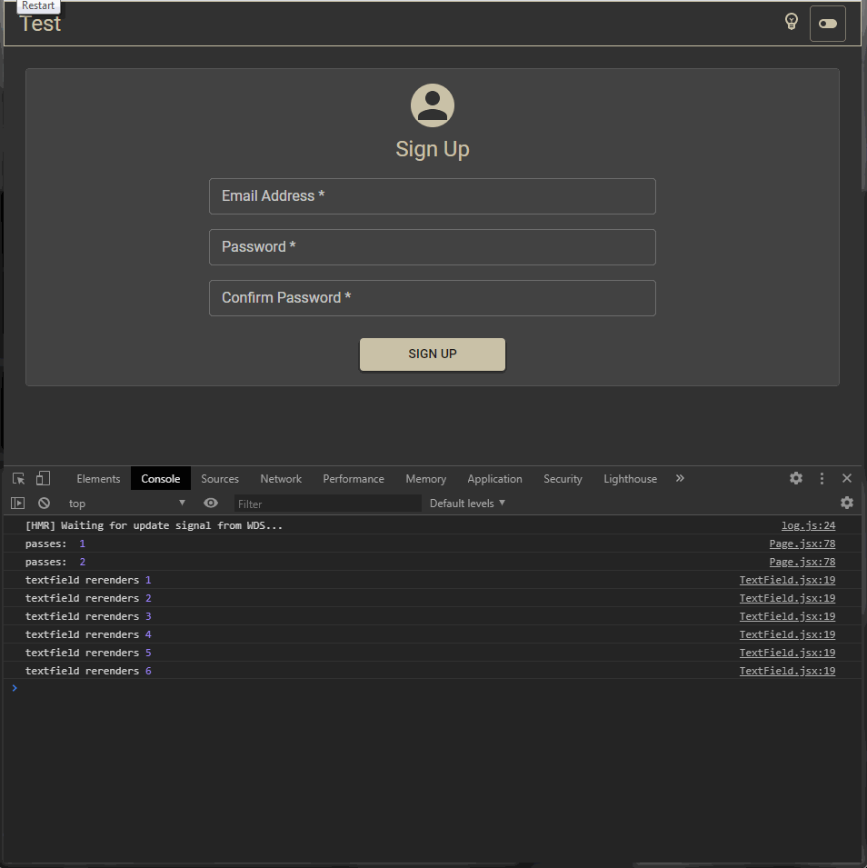

## Demonstrations

### Video with long explanations:
<a href="https://vimeo.com/424647673">Video</a> explaining (in Portuguese) what I was testing in each version (each commit) of the project. I plan to write an article in English in a future date.

### Gif with a simple demonstration of the interface:

This project was bootstrapped with [Create React App](https://github.com/facebook/create-react-app).

## Available Scripts

In the project directory, you can run:

### `yarn start`

Runs the app in the development mode. 
Open [http://localhost:3000](http://localhost:3000) to view it in the browser.

The page will reload if you make edits. 
You will also see any lint errors in the console.

## Comparison between the various approaches:

### <a href="https://github.com/jobsonita/test-react-materialui-unform-integration/commit/824ed742260dfd5c52a90f56ef4fc6b9e44a48a9">Controlled inputs</a>:

### <a href="https://github.com/jobsonita/test-react-materialui-unform-integration/commit/acdea4f9545389666abcaab101fe0293f027d75f">Controlled inputs, merged states</a>:

### <a href="https://github.com/jobsonita/test-react-materialui-unform-integration/commit/46de2926d3e36e56686af4b20b93312057073145">Semi uncontrolled inputs</a>:

### <a href="https://github.com/jobsonita/test-react-materialui-unform-integration/commit/028de9570eb0dd2b8ede8596b919b134e6c5676c">Uncontrolled inputs (through useRef)</a>:

### <a href="https://github.com/jobsonita/test-react-materialui-unform-integration/commit/51aa06f47ac1a0c8d137a6c0a3a211aacbffe991">Uncontrolled component (through useImperativeRef)</a> / <a href="https://github.com/jobsonita/test-react-materialui-unform-integration/commit/b8746611e7015a80d3cfb3752dfac6328a5aed45">Uncontrolled component (merged states)</a>

### <a href="https://github.com/jobsonita/test-react-materialui-unform-integration/commit/4a552343d3723abd90b867d4a3e1b910fdb7cd8e">Unform component</a> / <a href="https://github.com/jobsonita/test-react-materialui-unform-integration/commit/4075e7c197d1d7b9c4729ab9248b683468f2a1b1">Unform component (hybrid)</a>:

